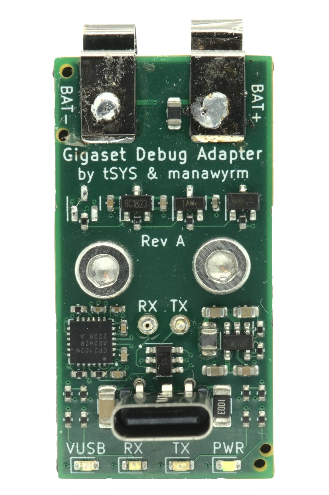

Gigaset-Debug-Adapter
=============================


### Overview

[Gigaset-Debug-Adapter](https://github.com/Manawyrm/Gigaset-Debug-Adapter) can be used with many Gigaset DECT phone models to access the internal UART.  
It's basically a 1.8V USB->UART converter, with switchable strapping logic and 3V step-down converter.

[dialog-cr16c-uart-boot](https://github.com/TobleMiner/dialog-cr16c-uart-boot) can be used to upload a stub to the phone through the boot ROM and access the SPI NOR flash chip.

https://user-images.githubusercontent.com/748791/209271987-683d4506-6c61-477d-b1db-ebee4b655a7c.mp4

### Manufacturing
The PCB can (and should) be assembled at [JLCPCBs](https://jlcpcb.com/) assembly service.  
Manufacturing files for the automatic assembly service can be found at `gerbers/RevB/Gigaset-Debug-Adapter/`.  
JLC can probably also manufacture the 3D printed adapter for you, altough this was never tested. Please report if you do.

Additionally, you will need:
- 2 Pogo pins. Tested with: 16,7 mm full length, 2,3 mm travel, 0.96 mm diameter
- 2 Keystone 5230 AAA battery contacts (2 slim pieces of tin sheet would probably work as well)
- 2 M3 threaded inserts (designed for CNCKitchen M3 x 5.7)
- 2 M3 machine screws
- 1 3D printable battery adapter (FDM with 0.3mm layer height, 35% infill worked well. Print upside down!)

Note: We've had trouble soldering to the Keystone 5230 using lead-free solder! Use leaded solder instead.

### CP2102N EEPROM

In order to enable the RX/TX LEDs, the internal EEPROM of the CP2102N USB->UART converter IC must be programmed to use the GPIO0 and GPIO1 pins as LED outputs.
This can be done eiher

* using SiLabs propritary Simplicity Studio,
* using the FOSS tool [ext/badge/cp2102 of cp210x-program](https://github.com/VCTLabs/cp210x-program)


#### EEPROM programming using Silabs Simplicity Studio


Simplicity Studio (and the experience of downloading it) is awful, be prepared and use a VM.   
This step is fully optional, you just lose the LEDs. Those are pretty and useful, but not required.

#### EEPROM programming using cp210x-program

The FOSS tool [cp210x-program](https://github.com/VCTLabs/cp210x-program) contains two separate programmers:
One python tool for CP2102, and the `ext/badge/cp2102` C program which we need here.

Do something like

```
./bin/cp2102 -p "Gigaset Debug Adapter" -g on
```

And then power-cycle the board to apply the new settings.

### Additional resources 

[Schematic - Rev. B](gerbers/RevB/Gigaset-Debug-Adapter/Gigaset-Debug-Adapter.pdf)  
[Bootloader utility - dialog-cr16c-uart-boot](https://github.com/TobleMiner/dialog-cr16c-uart-boot)  

### Errata
Rev.A: Bootloader Resistor logic is wrong, use Rev.B!

### Mechanicals
The battery adapter was designed using OpenSCAD. The definition file can be found as [battery-adapter.scad](battery-adapter.scad).

OpenSCAD will generate a .stl file, suitable for 3D printing. This file can be converted for use in KiCad using meshconv:
```bash
meshconv -c wrl battery-adapter.stl -o battery-adapter
```
